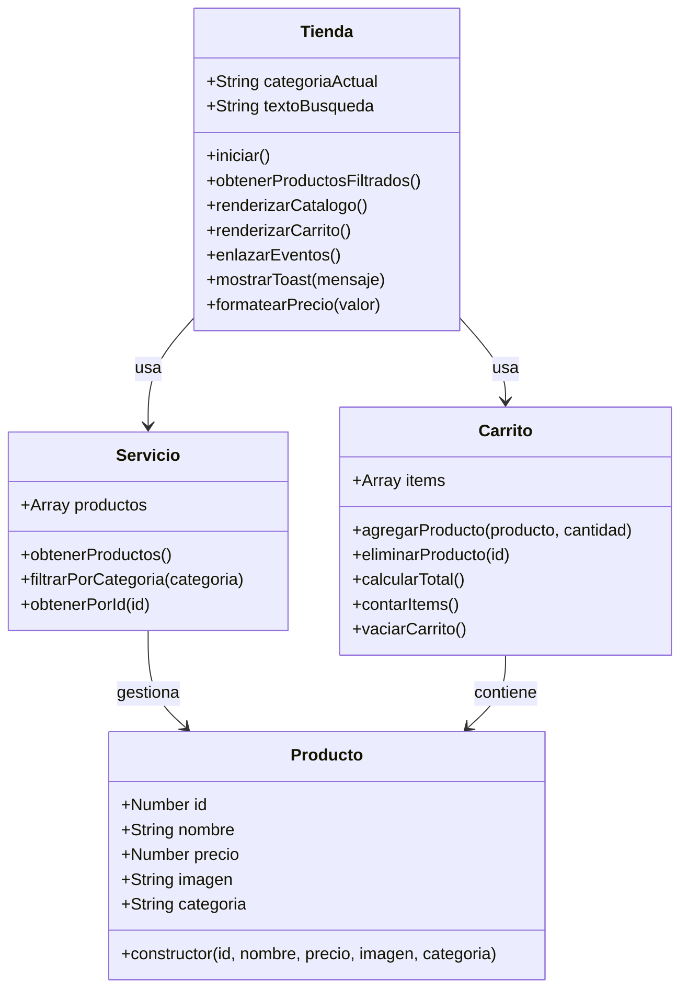
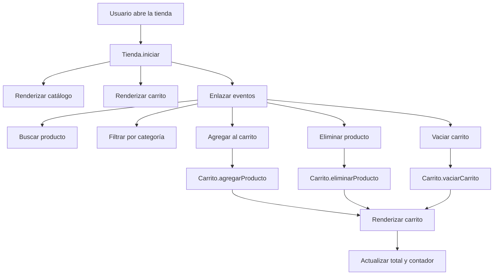
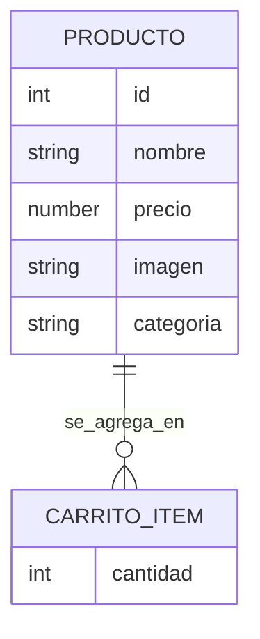
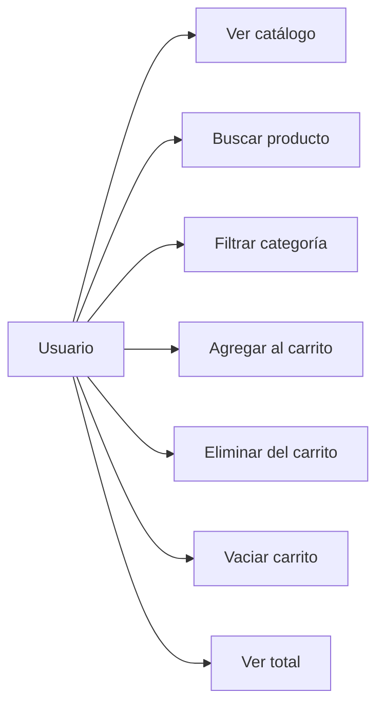

# TechStore — Documentación del Proyecto

TechStore es una tienda virtual desarrollada con HTML, CSS y JavaScript puro, orientada a demostrar Programación Orientada a Objetos, manipulación dinámica del DOM y una interfaz responsive con estilo tecnológico minimalista [file:1]. El proyecto sigue el enunciado de la hackathon, que exige clases como `Producto` y `Carrito`, catálogo generado desde JavaScript, eventos para agregar y eliminar productos, total en tiempo real y entrega en archivos separados `index.html`, `styles.css` y `script.js` [file:1].

## Objetivo

El objetivo del proyecto es construir una tienda virtual funcional donde el usuario pueda explorar productos, filtrarlos, buscarlos, agregarlos al carrito, eliminarlos y vaciar la compra, con actualización inmediata de la interfaz [file:1]. Esta solución responde a los criterios principales de evaluación: funcionalidad completa, uso correcto de POO, manipulación dinámica del DOM, diseño visual y organización del código [file:1].

## Stack tecnológico

| Tecnología | Uso en el proyecto |
|---|---|
| HTML5 | Estructura semántica de la interfaz [file:1] |
| CSS3 | Diseño responsive, grid, flexbox y estilo visual minimalista [file:1] |
| JavaScript | Lógica orientada a objetos, eventos y renderizado dinámico [file:1] |
| Google Fonts | Tipografía Inter para identidad visual moderna |

## Estructura de archivos

```text
techstore/
├── index.html
├── styles.css
└── script.js
```

Esta estructura coincide con los entregables esperados en el documento, que solicita explícitamente el código fuente separado en `index.html`, `styles.css` y `script.js` [file:1].

## Arquitectura general

La arquitectura del proyecto separa presentación, estilos y lógica, y además divide la lógica JavaScript en clases con responsabilidades específicas para mejorar claridad y mantenibilidad [file:1]. La entidad `Servicio` se añadió como capa de apoyo para el catálogo y los filtros, mientras `Tienda` coordina el renderizado y la interacción con el DOM, lo que fortalece el diseño orientado a objetos y la organización del proyecto [file:1].

### Capas

- **Vista:** `index.html` y `styles.css`.
- **Lógica de negocio:** `Producto`, `Carrito`, `Servicio`.
- **Coordinación UI + DOM:** `Tienda`.

## Diagrama de clases



El documento exige al menos las clases `Producto` y `Carrito`, y además permite clases adicionales como `Tienda` o `ProductoController`, por lo que esta ampliación mantiene coherencia con el requerimiento original [file:1].

## Flujo de interacción



Este flujo cubre los eventos obligatorios del enunciado: agregar, eliminar, vaciar y actualizar total, además del filtro o búsqueda opcional que se considera valioso en la evaluación [file:1].

## Componentes visuales

La interfaz usa una composición de encabezado, barra de búsqueda, filtros de categoría, catálogo en grid y panel lateral de carrito, adaptándose a móvil mediante media queries [file:1]. Esta decisión responde al requisito de una interfaz responsive y agradable visualmente usando Flexbox o Grid [file:1].

### Bloques principales

- **Header:** logo, nombre de la tienda, búsqueda y acceso visual al carrito.
- **Filtros:** botones por categoría.
- **Catálogo:** tarjetas dinámicas de productos.
- **Carrito:** panel con items, cantidades, subtotales y total.
- **Toast:** notificación breve al agregar o vaciar.

## Modelo de datos



Aunque el proyecto se implementa con clases JavaScript y no con base de datos, este modelo ayuda a documentar cómo se relacionan los productos con los ítems almacenados temporalmente dentro del carrito [file:1].

## Funcionalidades implementadas

| Funcionalidad | Estado | Descripción |
|---|---|---|
| Renderizado dinámico del catálogo | Completo | Los productos se crean desde JavaScript, no desde HTML fijo [file:1] |
| Agregar producto al carrito | Completo | El botón agrega el producto y actualiza la interfaz [file:1] |
| Eliminar producto del carrito | Completo | Cada ítem tiene acción de eliminación individual [file:1] |
| Vaciar carrito | Completo | El botón limpia todos los productos del carrito [file:1] |
| Cálculo total | Completo | El total se recalcula en tiempo real [file:1] |
| Búsqueda por nombre | Completo | Filtra productos según texto escrito [file:1] |
| Filtro por categoría | Completo | Cambia el catálogo mostrado por categoría [file:1] |
| Responsive design | Completo | La interfaz se adapta a escritorio y móvil [file:1] |

## Responsabilidades por clase

### `Producto`

Representa cada artículo del catálogo con sus datos base: identificador, nombre, precio, imagen y categoría [file:1]. Su responsabilidad es modelar la entidad de negocio pedida en el enunciado [file:1].

### `Carrito`

Administra la colección de productos elegidos por el usuario, incluyendo cantidad, total y operaciones principales como agregar, eliminar y vaciar [file:1]. Esta clase responde directamente a los métodos sugeridos por el documento de la hackathon [file:1].

### `Servicio`

Centraliza el acceso al catálogo y facilita operaciones como filtrar por categoría u obtener un producto por identificador. Aunque no es obligatoria, esta clase ayuda a no mezclar demasiada lógica en `Tienda` y mejora la organización del código, algo que también se evalúa [file:1].

### `Tienda`

Funciona como controlador de interfaz: toma los productos del servicio, los pinta en pantalla, escucha eventos del usuario y sincroniza el estado del carrito con el DOM [file:1]. Esta clase concentra la manipulación dinámica de elementos y la actualización visual en tiempo real que pide el proyecto [file:1].

## Casos de uso



Estos casos de uso resumen la experiencia mínima funcional que debe poder demostrarse durante la presentación en vivo del proyecto [file:1].

## Decisiones de diseño

La dirección visual elegida fue “tecnología minimalista”, con fondo claro, tarjetas limpias, contraste moderado, botones sólidos y tipografía moderna. Esta decisión busca coherencia entre el tema de productos tecnológicos y el criterio de creatividad con claridad visual mencionado por el documento [file:1].

## Guía para GitHub

Este archivo puede usarse como `README.md`, como base para una wiki o para páginas de documentación en GitHub, ya que incluye tablas, bloques de código y diagramas Mermaid compatibles con el render de GitHub. También puede dividirse en secciones para DeepWiki, por ejemplo: `arquitectura.md`, `clases.md`, `flujo.md` y `ui.md`.

### Secciones sugeridas para DeepWiki

- `README.md`: resumen del proyecto y arranque rápido.
- `docs/arquitectura.md`: clases, relaciones y flujo.
- `docs/componentes.md`: estructura visual y secciones de la interfaz.
- `docs/funcionalidades.md`: eventos, DOM y reglas del carrito.
- `docs/pitch.md`: resumen de la exposición final.

## Arranque rápido

```bash
# 1. Descargar o clonar el proyecto
# 2. Abrir la carpeta techstore
# 3. Ejecutar index.html en el navegador
```

Como el proyecto está hecho con HTML, CSS y JavaScript puro, no requiere instalación de dependencias ni compilación adicional, lo cual facilita la demostración y la entrega final [file:1].

## Pitch resumido

- **Nombre:** TechStore.
- **Tema:** tienda virtual de productos tecnológicos.
- **POO:** uso de `Producto`, `Carrito`, `Servicio` y `Tienda`.
- **DOM:** renderizado dinámico, eventos y actualización del carrito.
- **Valor agregado:** búsqueda, filtros, diseño minimalista y notificaciones visuales.

## Criterios cubiertos

| Criterio | Cómo se cubre |
|---|---|
| Funcionalidad completa | Agregar, quitar, vaciar y calcular total [file:1] |
| Uso correcto de POO | Clases, métodos, instancias y separación de responsabilidades [file:1] |
| Manipulación del DOM | Creación dinámica de catálogo y carrito con eventos [file:1] |
| Diseño y UX | Interfaz responsive, clara y coherente con el tema [file:1] |
| Código organizado | Archivos separados y lógica modular [file:1] |
| Originalidad | Enfoque visual de tecnología minimalista [file:1] |

## Posibles mejoras futuras

- Persistencia del carrito con almacenamiento local.
- Vista detallada de producto.
- Control de stock.
- Confirmación de compra.
- Más categorías y productos reales.
- Tests unitarios básicos para la lógica del carrito.

## Licencia de uso académico

Este proyecto puede presentarse como desarrollo académico para una hackathon o práctica de frontend enfocada en POO, DOM y diseño responsive [file:1].
